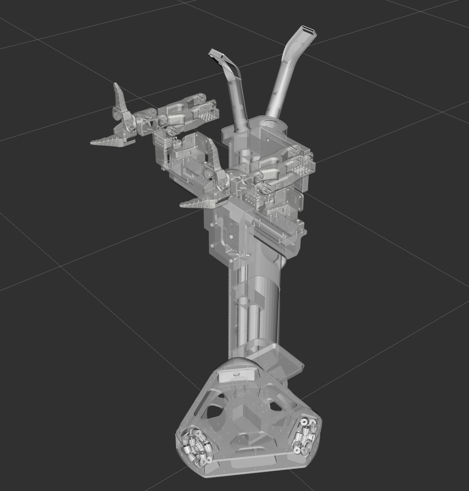

# AlohaMini-Simulation



This directory contains the simulation and visualization assets for **AlohaMini**. It provides dual-stack support for both **ROS 1** and **ROS 2**, enabling high-fidelity visualization in RViz and physics-based testing in Gazebo.

## ROS 2 — Build & Run (colcon)

These instructions target ROS 2 (colcon-based workspaces). Adjust the distro names (Foxy/Galactic/Humble/Jazzy) as needed.

1) Install prerequisites (example):

```bash
# install colcon and ros dependencies (example for Ubuntu)
sudo apt update
sudo apt install -y python3-colcon-common-extensions python3-rosdep
```

2) Build the workspace:

```bash
cd simulation
colcon build
```

3) Source the overlay before running:

```bash
source install/setup.bash
```

4) (Optional) Force FastDDS as the RMW implementation:

```bash
export RMW_IMPLEMENTATION=rmw_fastrtps_cpp
```

5) Run RViz2 visualization (example):

```bash
ros2 launch Aloha display.launch.py  # RViz2 visualization
```

Notes for ROS 2:
- Ensure you installed ROS 2 for your target distro and that `source /opt/ros/<distro>/setup.bash` is present in your shell if needed.
- If using mixed ROS1/ROS2 setups, configure the ROS1-ROS2 bridge separately.

## ROS 1 — Build & Run (catkin)

These instructions target ROS 1 (catkin-based workspaces) such as Melodic or Noetic.

1) Create a catkin workspace and place the repository in `src`:

```bash
mkdir -p ~/catkin_ws/src
cd ~/catkin_ws/src
# assuming AlohaMini repository is already cloned
ln -s /path/to/AlohaMini/simulation ~/catkin_ws/src/Aloha
cd ~/catkin_ws
```

2) Install and resolve dependencies with `rosdep`:

```bash
sudo apt update
sudo apt install -y python3-rosdep
sudo rosdep init   # only if rosdep isn't initialized yet
rosdep update
rosdep install --from-paths src --ignore-src -r -y
```

3) Build with `catkin_make`:

```bash
catkin_make
source devel/setup.bash
```

Or build with `catkin_tools` (`catkin build`):

```bash
sudo apt install -y python3-catkin-tools
cd ~/catkin_ws
catkin build
source devel/setup.bash
```

4) Run ROS 1 launch files:

```bash
roslaunch Aloha display.launch       # RViz visualization
roslaunch Aloha gazebo.launch        # Gazebo visualization
```

Notes for ROS 1:
- These commands are intended for Linux (Ubuntu). For Windows, use WSL or a Linux VM for better ROS1 support.
- If you see missing packages, double-check that package names and dependencies match your ROS distro (Melodic vs Noetic).

## Troubleshooting

- If RViz/RViz2 does not show robot models, ensure `robot_state_publisher` is running and `/tf` topics are being published.
- For mixed ROS1/ROS2 systems, verify your ROS1-ROS2 bridge configuration and topic remapping.
- If launches fail due to missing dependencies, run `rosdep install --from-paths src --ignore-src -r -y` in the workspace root.


## Acknowledgements
This module was originally developed as a standalone repository,
**lemon198/AlohaMini-Simulation**, and later integrated into the main **AlohaMini** project.
