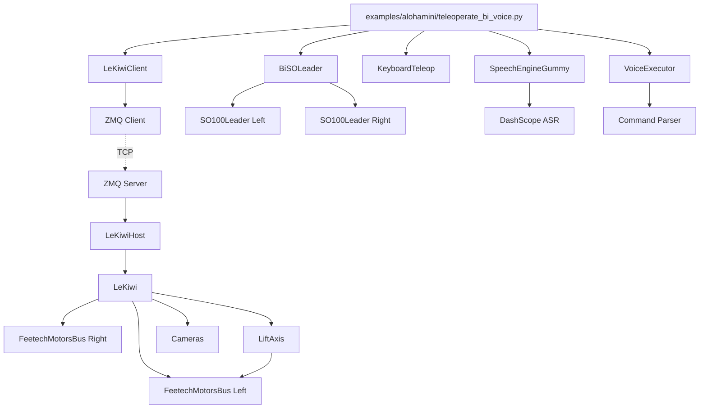

# AlohaMini Architecture Documentation

**A Complete Guide to the AlohaMini Bimanual Mobile Manipulation System**

---

## Table of Contents

1. [System Overview](#1-system-overview)
2. [Repository Structure](#2-repository-structure)
3. [Core Architecture](#3-core-architecture)
4. [Hardware Components](#4-hardware-components)
5. [Teleoperation Path](#5-teleoperation-path)
6. [Autonomous Execution Path](#6-autonomous-execution-path)
7. [Control Flow Deep Dive](#7-control-flow-deep-dive)
8. [Voice Control System](#8-voice-control-system)
9. [Data Recording and Datasets](#9-data-recording-and-datasets)
10. [Dependency Tree](#10-dependency-tree)
11. [Design Decisions and Gotchas](#11-design-decisions-and-gotchas)
12. [File Reference Map](#12-file-reference-map)

---

## 1. System Overview

### What is AlohaMini?

AlohaMini is a **bimanual mobile manipulation robot** built on the LeRobot framework. It consists of:

- **Two follower arms** (left and right, 6-DOF each: 5 joints + gripper)
- **Omnidirectional mobile base** (3-wheel holonomic drive)
- **Lift axis** (Z-axis vertical motion, 0-600mm range)
- **Two leader arms** (USB-connected to laptop for teleoperation)
- **Camera system** (configurable, currently disabled in default config)
- **Voice control** (speech recognition + command execution via DashScope Gummy)

### System Topology

```
┌─────────────────────────────────────────────────────────────────┐
│                      LAPTOP (Client Side)                        │
│                                                                   │
│  ┌─────────────────────────────────────────────────────────────┐│
│  │ examples/alohamini/teleoperate_bi_voice.py                   ││
│  │   - Main control loop (30 Hz)                                ││
│  │   - Action merging from multiple sources                     ││
│  └─────────────────────────────────────────────────────────────┘│
│                                                                   │
│  ┌──────────────────┐  ┌──────────────────┐  ┌────────────────┐ │
│  │ BiSOLeader    │  │ KeyboardTeleop   │  │ Voice System   │ │
│  │ (USB Serial)     │  │ (stdin)          │  │ (Microphone)   │ │
│  │                  │  │                  │  │                │ │
│  │ /dev/am_arm_     │  │ w/s/a/d/z/x     │  │ Gummy ASR →    │ │
│  │ leader_left      │  │ u/j (lift)       │  │ VoiceExecutor  │ │
│  │ leader_right     │  │ r/f (speed)      │  │                │ │
│  └──────────────────┘  └──────────────────┘  └────────────────┘ │
│                                                                   │
│  ┌─────────────────────────────────────────────────────────────┐│
│  │ LeKiwiClient (ZMQ PUSH/PULL)                                 ││
│  │   - Sends actions via ZMQ                                    ││
│  │   - Receives observations (state + base64 images)            ││
│  └─────────────────────────────────────────────────────────────┘│
└───────────────────────────────┬─────────────────────────────────┘
                                │ ZMQ over TCP
                                │ (cmd: 5555, obs: 5556)
┌───────────────────────────────▼─────────────────────────────────┐
│                      ROBOT (AlohaMini Hardware)                  │
│                                                                   │
│  ┌─────────────────────────────────────────────────────────────┐│
│  │ LeKiwiHost (ZMQ Server)                                      ││
│  │   - Receives action commands                                 ││
│  │   - Publishes observations                                   ││
│  │   - Watchdog: stops base if no cmd > 1.5s                   ││
│  └─────────────────────────────────────────────────────────────┘│
│                                                                   │
│  ┌─────────────────────────────────────────────────────────────┐│
│  │ LeKiwi (Robot Controller)                                    ││
│  │                                                               ││
│  │  ┌───────────────────────────┐  ┌──────────────────────────┐││
│  │  │ Left Motor Bus (Feetech)  │  │ Right Motor Bus (Feetech)│││
│  │  │ /dev/am_arm_follower_left │  │ /dev/am_arm_follower_rt  │││
│  │  │                           │  │                          │││
│  │  │ - Left arm (IDs 1-6)      │  │ - Right arm (IDs 1-6)    │││
│  │  │ - Base wheels (IDs 8-10)  │  │                          │││
│  │  │ - Lift motor (ID 11)      │  │                          │││
│  │  └───────────────────────────┘  └──────────────────────────┘││
│  │                                                               ││
│  │  ┌─────────────────────────────────────────────────────────┐││
│  │  │ LiftAxis Controller                                      │││
│  │  │   - Multi-turn tracking (-∞ to +∞ degrees)              │││
│  │  │   - Velocity mode with P-controller                      │││
│  │  │   - Homing to hard stop on startup                       │││
│  │  └─────────────────────────────────────────────────────────┘││
│  └─────────────────────────────────────────────────────────────┘│
└───────────────────────────────────────────────────────────────────┘
```

### Naming: AlohaMini vs LeKiwi

- **AlohaMini**: The **physical robot platform** (bimanual mobile manipulator)
- **LeKiwi**: The **software implementation class** in LeRobot
  - `LeKiwi`: Server-side robot controller (runs on robot hardware)
  - `LeKiwiClient`: Client-side remote interface (runs on laptop)
  - `LeKiwiHost`: ZMQ server wrapper around LeKiwi

**Why two names?** The robot was originally called "LeKiwi" in the codebase, but the physical platform is branded "AlohaMini". They refer to the same system.

---

## 2. Repository Structure

### Directory Tree

```
lerobot_alohamini/
│
├── examples/alohamini/           # AlohaMini-specific examples
│   ├── teleoperate_bi.py         # Basic bimanual teleoperation
│   ├── teleoperate_bi_voice.py   # Teleoperation + voice control
│   ├── record_bi.py              # Record teleoperation episodes → dataset
│   ├── evaluate_bi.py            # Run pretrained policy on robot
│   ├── replay_bi.py              # Replay recorded episodes
│   ├── voice_engine_gummy.py     # Speech recognition engine (ASR)
│   └── voice_exec.py             # Voice command parsing + execution
│
├── src/lerobot/
│   ├── robots/
│   │   ├── alohamini/
│   │   │   ├── lekiwi.py                # LeKiwi robot controller (server)
│   │   │   ├── lekiwi_client.py         # LeKiwi remote client
│   │   │   ├── lekiwi_host.py           # ZMQ host server wrapper
│   │   │   ├── config_lekiwi.py         # Configurations
│   │   │   └── lift_axis.py             # Z-axis lift controller
│   │   │
│   │   ├── bi_so_follower/           # Bimanual follower (SO100 arms)
│   │   │   ├── bi_so_follower.py
│   │   │   └── config_bi_so_follower.py
│   │   │
│   │   └── robot.py                     # Base Robot class
│   │
│   ├── teleoperators/
│   │   ├── bi_so_leader/             # Bimanual leader arms
│   │   │   ├── bi_so_leader.py
│   │   │   └── config_bi_so_leader.py
│   │   │
│   │   ├── keyboard/                    # Keyboard teleoperation
│   │   │   └── teleop_keyboard.py
│   │   │
│   │   └── teleoperator.py              # Base Teleoperator class
│   │
│   ├── motors/
│   │   ├── feetech/                     # Feetech motor bus (STS3215)
│   │   │   ├── feetech.py
│   │   │   └── tables.py
│   │   │
│   │   └── motors_bus.py
│   │
│   ├── cameras/                         # Camera abstraction
│   │   ├── opencv/
│   │   └── realsense/
│   │
│   ├── datasets/                        # Dataset management
│   │   ├── lerobot_dataset.py
│   │   └── utils.py
│   │
│   ├── policies/                        # Policies (ACT, Diffusion, etc.)
│   │   └── act/
│   │
│   ├── processor/                       # Data processors
│   │   └── pipeline.py
│   │
│   └── scripts/                         # CLI scripts
│       ├── lerobot_record.py
│       ├── lerobot_eval.py
│       └── lerobot_train.py
│
└── pyproject.toml                       # Dependencies
```

### Key Module Relationships



---

## 3. Core Architecture

### The Three Layers

1. **Hardware Abstraction Layer**
   - `FeetechMotorsBus`: Low-level serial communication with motors
   - `Camera`: Image capture from cameras
   - `LiftAxis`: Z-axis multi-turn tracking + control

2. **Robot Layer**
   - `LeKiwi`: Server-side robot controller
   - `LeKiwiClient`: Client-side remote interface
   - Observation/Action dictionaries

3. **Application Layer**
   - Teleoperation scripts
   - Recording scripts
   - Evaluation scripts
   - Voice control

### State and Action Spaces

**Observation Space** (from robot):
```python
{
    # Left arm (6 DOF)
    "arm_left_shoulder_pan.pos": float,
    "arm_left_shoulder_lift.pos": float,
    "arm_left_elbow_flex.pos": float,
    "arm_left_wrist_flex.pos": float,
    "arm_left_wrist_roll.pos": float,
    "arm_left_gripper.pos": float,

    # Right arm (6 DOF)
    "arm_right_shoulder_pan.pos": float,
    "arm_right_shoulder_lift.pos": float,
    "arm_right_elbow_flex.pos": float,
    "arm_right_wrist_flex.pos": float,
    "arm_right_wrist_roll.pos": float,
    "arm_right_gripper.pos": float,

    # Base (body-frame velocities)
    "x.vel": float,          # m/s (forward/backward)
    "y.vel": float,          # m/s (left/right)
    "theta.vel": float,      # deg/s (rotation)

    # Lift axis
    "lift_axis.height_mm": float,  # mm (0-600)

    # Cameras (if configured)
    # "head_top": np.ndarray (H, W, 3),
    # "wrist_left": np.ndarray (H, W, 3),
    # ...
}
```

**Action Space** (to robot):
Same structure as observation space (mirror control).

### Communication Protocol

**ZMQ Sockets**:
- **Command channel** (PUSH/PULL): Laptop → Robot
  - Port: 5555
  - Payload: JSON-serialized action dict
  - Example: `{"arm_left_shoulder_pan.pos": 45.0, "x.vel": 0.2, ...}`

- **Observation channel** (PULL/PUSH): Robot → Laptop
  - Port: 5556
  - Payload: JSON with base64-encoded images
  - Example: `{"arm_left_shoulder_pan.pos": 45.0, "head_top": "base64...", ...}`

**Watchdog**: If no command received for >1.5 seconds, robot stops base wheels ([lekiwi_host.py:91-96](src/lerobot/robots/alohamini/lekiwi_host.py#L91-L96)).

---

## 4. Hardware Components

### Motor Configuration

**Left Bus** (`/dev/am_arm_follower_left`):
```
ID   Motor Name                Type         Control Mode
──────────────────────────────────────────────────────────
1    arm_left_shoulder_pan     STS3215      Position
2    arm_left_shoulder_lift    STS3215      Position
3    arm_left_elbow_flex       STS3215      Position
4    arm_left_wrist_flex       STS3215      Position
5    arm_left_wrist_roll       STS3215      Position
6    arm_left_gripper          STS3215      Position
8    base_left_wheel           STS3215      Velocity
9    base_back_wheel           STS3215      Velocity
10   base_right_wheel          STS3215      Velocity
11   lift_axis                 STS3215      Velocity (multi-turn)
```

**Right Bus** (`/dev/am_arm_follower_right`):
```
ID   Motor Name                Type         Control Mode
──────────────────────────────────────────────────────────
1    arm_right_shoulder_pan    STS3215      Position
2    arm_right_shoulder_lift   STS3215      Position
3    arm_right_elbow_flex      STS3215      Position
4    arm_right_wrist_flex      STS3215      Position
5    arm_right_wrist_roll      STS3215      Position
6    arm_right_gripper         STS3215      Position
```

### Omnidirectional Base Kinematics

**Forward Kinematics** (wheel velocities → body velocities):

[lekiwi.py:429-477](src/lerobot/robots/alohamini/lekiwi.py#L429-L477)

```python
def _wheel_raw_to_body(left_wheel, back_wheel, right_wheel):
    # Convert raw commands to deg/s
    wheel_degps = [_raw_to_degps(w) for w in [left, back, right]]

    # Convert to rad/s, then to linear speed (m/s)
    wheel_radps = wheel_degps * (π/180)
    wheel_linear_speeds = wheel_radps * wheel_radius

    # Kinematic matrix (120° spacing, -90° offset)
    angles = [150°, 270°, 30°]  # in radians
    M = [[cos(θ), sin(θ), base_radius] for θ in angles]

    # Solve: body_vel = M^-1 * wheel_speeds
    [x, y, θ] = M^-1 @ wheel_linear_speeds

    return {x.vel: -x, y.vel: -y, theta.vel: θ}
```

**Inverse Kinematics** (body velocities → wheel velocities):

[lekiwi.py:364-427](src/lerobot/robots/alohamini/lekiwi.py#L364-L427)

```python
def _body_to_wheel_raw(x, y, theta):
    # Build velocity vector
    θ_rad = theta * (π/180)
    velocity_vector = [-x, -y, θ_rad]

    # Kinematic matrix
    angles = [150°, 270°, 30°]
    M = [[cos(θ), sin(θ), base_radius] for θ in angles]

    # Forward solve: wheel_speeds = M @ body_vel
    wheel_linear_speeds = M @ velocity_vector
    wheel_angular_speeds = wheel_linear_speeds / wheel_radius
    wheel_degps = wheel_angular_speeds * (180/π)

    # Scale if exceeds max_raw (3000)
    if max(abs(wheel_degps)) > max_raw:
        scale = max_raw / max(abs(wheel_degps))
        wheel_degps *= scale

    # Convert to raw commands
    return {
        base_left_wheel: _degps_to_raw(wheel_degps[0]),
        base_back_wheel: _degps_to_raw(wheel_degps[1]),
        base_right_wheel: _degps_to_raw(wheel_degps[2]),
    }
```

### Lift Axis (Z-Axis) Deep Dive

**Physical Setup**:
- Lead screw: 84 mm/revolution
- Travel range: 0-600 mm
- Motor: Feetech STS3215 (ID 11 on left bus)
- Multi-turn tracking (handles >360° rotation)

**Homing Procedure** ([lift_axis.py:105-146](src/lerobot/robots/alohamini/lift_axis.py#L105-L146)):

```python
def home():
    # Drive downward at constant velocity
    bus.write("Goal_Velocity", "lift_axis", home_down_speed)

    # Poll until stall detected (current spike OR no movement)
    while True:
        current_ma = read_current() * 6.5
        position_delta = abs(current_tick - last_tick)

        if current_ma >= stall_threshold OR position_delta < 10:
            stuck_count += 1
        else:
            stuck_count = 0

        if stuck_count >= 2:
            break  # Hit hard stop

    # Disable torque, wait for settling
    bus.write("Torque_Enable", "lift_axis", 0)
    time.sleep(1)

    # Set current position as zero reference
    _z0_deg = _extended_deg()
    # Now get_height_mm() will return ~0
```

**Multi-Turn Tracking** ([lift_axis.py:84-95](src/lerobot/robots/alohamini/lift_axis.py#L84-L95)):

```python
def _update_extended_ticks():
    # Read raw tick (0-4095)
    cur_tick = read("Present_Position")

    # Compute delta with wraparound handling
    delta = cur_tick - last_tick
    if delta > 2048:    # Wrapped backward
        delta -= 4096
    elif delta < -2048: # Wrapped forward
        delta += 4096

    # Accumulate
    extended_ticks += delta
    last_tick = cur_tick
```

**P-Controller** ([lift_axis.py:158-177](src/lerobot/robots/alohamini/lift_axis.py#L158-L177)):

```python
def update():
    """Call every frame (30-100 Hz)"""
    cur_mm = get_height_mm()
    err = target_mm - cur_mm

    # Reached?
    if abs(err) <= tolerance_mm:  # 1.0 mm
        write("Goal_Velocity", 0)
        target_mm = None
        return

    # P control
    velocity = KP * err  # KP = 300
    velocity = clamp(velocity, -v_max, +v_max)  # v_max = 1300

    write("Goal_Velocity", int(dir_sign * velocity))
```

---

## 5. Teleoperation Path

### Data Flow

```
┌─────────────────────────────────────────────────────────────────┐
│ Main Loop (examples/alohamini/teleoperate_bi_voice.py:77-105)   │
│                           30 Hz                                  │
└─────────────────────────────────────────────────────────────────┘
        │
        ├─► 1. Get current robot height
        │      robot.get_observation()["lift_axis.height_mm"]
        │      ├─► LeKiwiClient._get_data()
        │      │   └─► ZMQ poll → parse JSON → decode base64 images
        │      └─► execu.update_height_mm(cur_h)
        │
        ├─► 2. Poll voice engine
        │      text = speech.get_text_nowait()
        │      ├─► Check queue.Queue for finalized ASR text
        │      └─► if text: execu.handle_text(text)
        │          └─► Parse command → set sticky Z target / hold cmd
        │
        ├─► 3. Get leader arm actions
        │      arm_actions = leader.get_action()
        │      ├─► BiSOLeader.get_action()
        │      │   ├─► left_arm.get_action()
        │      │   └─► right_arm.get_action()
        │      └─► Returns: {"left_shoulder_pan.pos": v, ...}
        │          Renamed to: {"arm_left_shoulder_pan.pos": v, ...}
        │
        ├─► 4. Get keyboard input
        │      keyboard_keys = keyboard.get_action()
        │      ├─► Returns list of pressed keys: ['w', 'u', ...]
        │      │
        │      ├─► base_action = robot._from_keyboard_to_base_action(keys)
        │      │   └─► w/s → x.vel, z/x → y.vel, a/d → theta.vel
        │      │
        │      └─► lift_action = robot._from_keyboard_to_lift_action(keys)
        │          └─► u/j → lift_axis.height_mm += step_mm
        │
        ├─► 5. Get voice actions
        │      voice_action = execu.get_action_nowait()
        │      ├─► Held base command (if within time window)
        │      ├─► Sticky Z target pursuit (if not reached)
        │      └─► One-shot actions (cleared after 1 frame)
        │
        ├─► 6. Merge all actions
        │      action = {**arm_actions, **base_action,
        │                **lift_action, **voice_action}
        │      Priority: later dict overwrites earlier
        │
        └─► 7. Send action to robot
               robot.send_action(action)
               ├─► LeKiwiClient.send_action()
               │   └─► ZMQ push: json.dumps(action)
               │
               └─► Robot receives → LeKiwiHost main loop
                   └─► robot.send_action(action)
                       ├─► Separate arm_left/arm_right by prefix
                       ├─► Body vel → wheel kinematics
                       ├─► lift_axis.apply_action(action)
                       │   └─► set_height_target_mm()
                       ├─► left_bus.sync_write("Goal_Position", left_arm)
                       ├─► right_bus.sync_write("Goal_Position", right_arm)
                       └─► left_bus.sync_write("Goal_Velocity", base_wheels)
```

### Teleoperation Script Walkthrough

[teleoperate_bi_voice.py:1-110](examples/alohamini/teleoperate_bi_voice.py#L1-L110)

```python
# Line 7-15: Import robot, teleoperators, voice modules
from lerobot.robots.alohamini import LeKiwiClient, LeKiwiClientConfig
from lerobot.teleoperators.bi_so_leader import BiSOLeader
from lerobot.teleoperators.keyboard.teleop_keyboard import KeyboardTeleop
from voice_engine_gummy import SpeechEngineGummy
from voice_exec import VoiceExecutor

# Line 30-39: Create configs and instantiate devices
robot_config = LeKiwiClientConfig(remote_ip="127.0.0.1", id="my_alohamini")
robot = LeKiwiClient(robot_config)
leader = BiSOLeader(bi_cfg)
keyboard = KeyboardTeleop(KeyboardTeleopConfig())

# Line 42-58: Setup speech engine with hotwords
speech = SpeechEngineGummy(SpeechConfig(
    model="gummy-chat-v1",
    vocabulary_prefix="gummyam",
    hotwords=["上升", "下降", "前进", ..., "forward", "backward", ...]
))
execu = VoiceExecutor(ExecConfig(xy_speed_cmd=0.20, theta_speed_cmd=500.0))

# Line 61-67: Connect all devices
robot.connect()  # ZMQ sockets
leader.connect()  # USB serial
keyboard.connect()  # stdin listener
speech.start()  # Microphone + ASR thread

# Line 77-105: Main loop at 30 Hz
while True:
    t0 = time.perf_counter()

    # Get current height for voice executor
    observation = robot.get_observation()
    cur_h = observation.get("lift_axis.height_mm", 0.0)
    execu.update_height_mm(cur_h)

    # Poll voice
    text = speech.get_text_nowait()
    if text:
        execu.handle_text(text)

    # Get actions from all sources
    arm_actions = leader.get_action()
    keyboard_keys = keyboard.get_action()
    base_action = robot._from_keyboard_to_base_action(keyboard_keys)
    lift_action = robot._from_keyboard_to_lift_action(keyboard_keys)
    voice_action = execu.get_action_nowait()

    # Merge (later overwrites earlier)
    action = {**arm_actions, **base_action, **lift_action, **voice_action}

    # Send to robot
    robot.send_action(action)

    # Maintain 30 Hz
    precise_sleep(max(1.0 / 30 - (time.perf_counter() - t0), 0.0))
```

---

## 6. Autonomous Execution Path

### Evaluation Workflow

```
┌─────────────────────────────────────────────────────────────────┐
│ Main Loop (examples/alohamini/evaluate_bi.py:74-88)             │
│                           30 Hz                                  │
└─────────────────────────────────────────────────────────────────┘
        │
        ├─► 1. Load pretrained policy
        │      policy = ACTPolicy.from_pretrained("hf_model_id")
        │      preprocessor, postprocessor = make_pre_post_processors(...)
        │
        ├─► 2. Create evaluation dataset
        │      dataset = LeRobotDataset.create(repo_id="eval_dataset", ...)
        │
        └─► 3. Run record_loop with policy
               record_loop(
                   robot=robot,
                   policy=policy,
                   preprocessor=preprocessor,
                   postprocessor=postprocessor,
                   dataset=dataset,
                   ...
               )
               ├─► Get observation from robot
               │      obs = robot.get_observation()
               │      obs = robot_observation_processor(obs)
               │
               ├─► Preprocess for policy
               │      obs_batch = preprocessor(obs)
               │      # Normalize, reshape, move to GPU, etc.
               │
               ├─► Policy forward pass
               │      action_batch = policy(obs_batch)
               │      # Neural network inference
               │
               ├─► Postprocess action
               │      action = postprocessor(action_batch)
               │      # Denormalize, reshape to robot space
               │      action = robot_action_processor(action)
               │
               ├─► Send to robot
               │      robot.send_action(action)
               │
               └─► Record to evaluation dataset
                      dataset.save_frame(obs, action)
```

### Policy Inference Call Graph

```
policy(observation)
  └─► ACTPolicy.forward(obs_dict)
      ├─► Encode observations
      │   ├─► ResNet encoder for images
      │   └─► Linear layer for state
      ├─► Transformer decoder
      │   ├─► Learned action queries
      │   └─► Cross-attention to encoded obs
      └─► Decode to action space
          └─► Return predicted actions (chunk of next N steps)
```

### Processor Pipeline

**Preprocessing** (obs → policy input):
```
Raw observation dict
  ├─► ObservationProcessor
  │   ├─► Select relevant keys
  │   └─► Rename if needed
  ├─► NormalizeProcessor
  │   └─► (x - mean) / std  [using dataset.meta.stats]
  ├─► DeviceProcessor
  │   └─► Move tensors to GPU
  └─► BatchProcessor
      └─► Add batch dimension
```

**Postprocessing** (policy output → robot action):
```
Policy output batch
  ├─► DenormalizeProcessor
  │   └─► x * std + mean
  ├─► RenameProcessor
  │   └─► Map policy keys to robot keys
  └─► UnbatchProcessor
      └─► Remove batch dimension
```

---

## 7. Control Flow Deep Dive

### Robot Server Loop (LeKiwiHost)

[lekiwi_host.py:51-136](src/lerobot/robots/alohamini/lekiwi_host.py#L51-L136)

```python
# Line 52-63: Initialize robot and ZMQ server
robot = LeKiwi(LeKiwiConfig())
robot.connect()  # Connects motors, runs homing
host = LeKiwiHost(LeKiwiHostConfig())

# Line 69-123: Main loop
while duration < 6000:  # Run for ~1.7 hours
    loop_start = time.time()

    # 1. Try to receive command
    try:
        msg = zmq_cmd_socket.recv_string(zmq.NOBLOCK)
        action = json.loads(msg)
        robot.send_action(action)
        last_cmd_time = time.time()
        watchdog_active = False
    except zmq.Again:
        # No command available
        pass

    # 2. Watchdog check
    if (time.time() - last_cmd_time > 1.5) and not watchdog_active:
        logging.warning("Watchdog timeout! Stopping base.")
        robot.stop_base()
        watchdog_active = True

    # 3. Update lift axis P-controller
    robot.lift.update()

    # 4. Read robot state
    obs = robot.get_observation()

    # 5. Encode images to base64
    for cam_key in robot.cameras:
        ret, buffer = cv2.imencode(".jpg", obs[cam_key])
        obs[cam_key] = base64.b64encode(buffer).decode("utf-8")

    # 6. Send observation to client
    zmq_observation_socket.send_string(json.dumps(obs))

    # 7. Sleep to maintain 30 Hz
    elapsed = time.time() - loop_start
    time.sleep(max(1/30 - elapsed, 0))
```

### Robot Action Execution (LeKiwi.send_action)

[lekiwi.py:530-595](src/lerobot/robots/alohamini/lekiwi.py#L530-L595)

```python
def send_action(action: dict) -> dict:
    # 1. Separate left and right arm actions
    left_pos = {k: v for k, v in action.items()
                if k.endswith(".pos") and k.startswith("arm_left_")}
    right_pos = {k: v for k, v in action.items()
                 if k.endswith(".pos") and k.startswith("arm_right_")}

    # 2. Extract base velocities
    base_vel = {k: v for k, v in action.items() if k.endswith(".vel")}

    # 3. Convert body vel to wheel commands
    wheel_vel = _body_to_wheel_raw(
        base_vel["x.vel"],
        base_vel["y.vel"],
        base_vel["theta.vel"]
    )

    # 4. Apply safety limits (max_relative_target)
    if max_relative_target is not None:
        present_left = left_bus.sync_read("Present_Position", left_arm_motors)
        left_pos = ensure_safe_goal_position(left_pos, present_left, max_rel)
        # Same for right arm

    # 5. Apply lift axis action
    lift.apply_action(action)  # Sets height target if present

    # 6. Write to motor buses
    if left_pos:
        left_bus.sync_write("Goal_Position", left_pos)
    if right_pos:
        right_bus.sync_write("Goal_Position", right_pos)
    left_bus.sync_write("Goal_Velocity", wheel_vel)

    return action  # Return what was actually sent
```

### Observation Reading (LeKiwi.get_observation)

[lekiwi.py:485-528](src/lerobot/robots/alohamini/lekiwi.py#L485-L528)

```python
def get_observation() -> dict:
    # 1. Read arm positions
    left_pos = left_bus.sync_read("Present_Position", left_arm_motors)
    right_pos = right_bus.sync_read("Present_Position", right_arm_motors)

    # 2. Read base wheel velocities
    base_wheel_vel = left_bus.sync_read("Present_Velocity", base_motors)

    # 3. Convert wheel vel to body vel
    base_vel = _wheel_raw_to_body(
        base_wheel_vel["base_left_wheel"],
        base_wheel_vel["base_back_wheel"],
        base_wheel_vel["base_right_wheel"],
    )

    # 4. Construct state dict
    obs_dict = {
        **{f"{k}.pos": v for k, v in left_pos.items()},
        **{f"{k}.pos": v for k, v in right_pos.items()},
        **base_vel,  # x.vel, y.vel, theta.vel
    }

    # 5. Add lift axis height
    lift.contribute_observation(obs_dict)
    # Adds "lift_axis.height_mm" key

    # 6. Overcurrent protection check
    read_and_check_currents(limit_ma=2000)
    # If 20 consecutive reads > 2000mA: disconnect and exit

    # 7. Read camera images
    for cam_key, cam in cameras.items():
        obs_dict[cam_key] = cam.async_read()

    return obs_dict
```

---

## 8. Voice Control System

### Architecture

```
┌─────────────────────────────────────────────────────────────────┐
│                     Voice Control Pipeline                       │
└─────────────────────────────────────────────────────────────────┘
        │
        ├─► 1. Audio Capture
        │      SpeechEngineGummy._audio_cb()
        │      ├─► sounddevice.InputStream (mic)
        │      ├─► Device sample rate (e.g. 44.1k or 48k)
        │      └─► Queue audio chunks (50ms)
        │
        ├─► 2. Voice Activity Detection
        │      SpeechEngineGummy._run()
        │      ├─► Resample to 16 kHz
        │      │   └─► scipy.signal.resample_poly (high quality)
        │      │       OR linear interpolation (fallback)
        │      │
        │      ├─► Compute energy (dBFS)
        │      │   └─► dbfs(x) = 20*log10(rms(x))
        │      │
        │      ├─► Track ambient noise level
        │      │   └─► env_db = 0.9*env_db + 0.1*cur_db
        │      │
        │      └─► Gate: is_voice = (db >= max(min_db, env_db + margin))
        │          └─► min_db = -30 dBFS, margin = 7 dB
        │
        ├─► 3. Phrase Segmentation
        │      ├─► Start new phrase on first voice frame
        │      ├─► End phrase after 1000 ms silence
        │      └─► Force end after 15 seconds max
        │
        ├─► 4. Speech Recognition
        │      _GummyOneShot
        │      ├─► DashScope TranslationRecognizerChat
        │      │   ├─► Model: "gummy-chat-v1"
        │      │   ├─► Format: PCM 16-bit, 16 kHz
        │      │   ├─► Vocabulary ID (hotwords)
        │      │   └─► max_end_silence: 1200 ms
        │      │
        │      ├─► One-shot session per phrase
        │      │   └─► start() → send_audio() → stop()
        │      │
        │      └─► Extract final text
        │          └─► on_event() callback stores result
        │
        └─► 5. Command Parsing & Execution
               VoiceExecutor.handle_text()
               ├─► Parse command
               │   └─► parse_command(text) → action dict
               │
               ├─► Classify command type
               │   ├─► Emergency stop
               │   ├─► Sticky Z target (absolute)
               │   ├─► Cancel Z target
               │   ├─► Hold N seconds (base motion)
               │   ├─► Relative lift
               │   ├─► Instant rotation
               │   └─► Replay trigger
               │
               └─► Update executor state
                   ├─► _sticky_z_target_mm
                   ├─► _held_cmd + _hold_until
                   └─► _one_shot_action
```

### Voice Command Examples

**Sticky Height Commands** ([voice_exec.py:188-219](examples/alohamini/voice_exec.py#L188-L219)):

| Voice Input              | Parsed Action                          |
|--------------------------|----------------------------------------|
| "升到 10 厘米"           | `{"__sticky_z_mm": 100.0}`            |
| "set height to 5 cm"     | `{"__sticky_z_mm": 50.0}`             |
| "raise to 200 mm"        | `{"__sticky_z_mm": 200.0}`            |
| "取消高度"               | `{"__cancel_z": True}`                |

**Hold Commands** ([voice_exec.py:164-174](examples/alohamini/voice_exec.py#L164-L174)):

| Voice Input              | Parsed Action                                      |
|--------------------------|----------------------------------------------------|
| "forward 3 seconds"      | `{kind: "forward", secs: 3.0}`                    |
| "左转 两 秒"             | `{kind: "rotate_left", secs: 2.0}`                |
| "右移 half second"       | `{kind: "right", secs: 0.5}`                      |

**Number Normalization** ([voice_exec.py:127-144](examples/alohamini/voice_exec.py#L127-L144)):

| Input              | Output  |
|--------------------|---------|
| "3"                | 3.0     |
| "三"               | 3.0     |
| "three"            | 3.0     |
| "2.5"              | 2.5     |
| "二点五"           | 2.5     |
| "two point five"   | 2.5     |
| "half"             | 0.5     |
| "一十五"           | 15.0    |
| "twenty three"     | 23.0    |

### Voice Executor State Machine

[voice_exec.py:261-398](examples/alohamini/voice_exec.py#L261-L398)

```python
class VoiceExecutor:
    def __init__(self):
        self._now_height_mm = 0.0           # Current measured height
        self._sticky_z_target_mm = None     # Absolute height target (persistent)
        self._held_cmd = {}                 # Base cmd held for duration
        self._hold_until = 0.0              # Timestamp when hold expires
        self._one_shot_action = {}          # Single-frame action

    def update_height_mm(self, h):
        """Update current height (from robot observation)"""
        self._now_height_mm = h

    def handle_text(self, text):
        """Process recognized utterance"""
        # 1. Parse to check for hold pattern
        hold = _parse_hold(text)
        if hold:
            self._held_cmd = _kind_to_cmd(hold["kind"])
            self._hold_until = time.time() + hold["secs"]
            self._one_shot_action = dict(self._held_cmd)
            return

        # 2. Parse generic command
        parsed = parse_command(text)

        if "__stop" in parsed:
            # Emergency stop: clear everything, set vel=0
            self._held_cmd.clear()
            self._sticky_z_target_mm = None
            self._one_shot_action = {"x.vel": 0, "y.vel": 0, "theta.vel": 0}

        elif "__sticky_z_mm" in parsed:
            # Absolute sticky Z target
            self._sticky_z_target_mm = parsed["__sticky_z_mm"]

        elif "__cancel_z" in parsed:
            # Cancel sticky Z
            self._sticky_z_target_mm = None

        elif "lift_axis.height_mm" in parsed:
            # Relative lift → convert to absolute sticky Z
            delta = parsed["lift_axis.height_mm"]
            self._sticky_z_target_mm = self._now_height_mm + delta

        elif "__replay" in parsed:
            # Launch replay subprocess
            dataset = parsed["__replay"]["dataset"]
            episode = parsed["__replay"]["episode"]
            cmd = [sys.executable, "examples/alohamini/replay_bi.py",
                   "--dataset", dataset, "--episode", str(episode)]
            subprocess.Popen(cmd)

        else:
            # Instant vel command
            self._one_shot_action = {k: v for k, v in parsed.items()
                                     if k in ("x.vel", "y.vel", "theta.vel")}

    def get_action_nowait(self):
        """Return action for current frame"""
        act = {}

        # Held command (time-based)
        if self._held_cmd and time.time() < self._hold_until:
            act.update(self._held_cmd)
        elif self._held_cmd:
            self._held_cmd.clear()

        # Sticky Z pursuit
        if self._sticky_z_target_mm is not None:
            if abs(self._now_height_mm - self._sticky_z_target_mm) <= epsilon:
                self._sticky_z_target_mm = None  # Reached
            else:
                act["lift_axis.height_mm"] = self._sticky_z_target_mm

        # One-shot action (cleared after 1 frame)
        if self._one_shot_action:
            act.update(self._one_shot_action)
            self._one_shot_action.clear()

        return act
```

---

## 9. Data Recording and Datasets

### What is "Recording"?

Recording means capturing synchronized (observation, action) pairs during teleoperation and saving them to a **LeRobot dataset**. This dataset is later used to train imitation learning policies.

### Recording Workflow

[record_bi.py:1-148](examples/alohamini/record_bi.py#L1-L148)

```
1. Setup
   ├─► Create dataset features from robot.observation_features + robot.action_features
   ├─► Create LeRobotDataset (local or resume existing)
   └─► Connect robot + leader arms + keyboard

2. Main Episode Loop
   ├─► record_loop(robot, teleop, dataset, control_time_s=60)
   │   └─► lerobot/scripts/lerobot_record.py:record_loop()
   │       ├─► Loop at 30 Hz for 60 seconds
   │       ├─► Each frame:
   │       │   ├─► obs = robot.get_observation()
   │       │   ├─► action = merge(leader.get_action(), keyboard.get_action())
   │       │   ├─► robot.send_action(action)
   │       │   └─► dataset.add_frame(obs, action)
   │       └─► After loop: frames buffered in memory
   │
   ├─► Reset environment
   │   └─► record_loop(robot, teleop, control_time_s=10)
   │       └─► Teleop to reset scene (NOT saved to dataset)
   │
   └─► Save episode
       ├─► dataset.save_episode()
       │   ├─► Write frames to disk (.safetensors format)
       │   ├─► Encode images to video (MP4)
       │   └─► Update metadata (episode_index, timestamps, stats)
       └─► dataset.push_to_hub()
           └─► Upload to HuggingFace Hub

3. Cleanup
   └─► dataset.finalize() → push final metadata
```

### Dataset Structure

```
liyitenga/record_20251015131957/   # HuggingFace repo
├── README.md                       # Dataset card (auto-generated)
├── meta/
│   ├── episode_data_index.parquet  # Episode metadata
│   └── stats.parquet               # Normalization stats (mean, std, min, max)
├── data/
│   ├── frame_000000.safetensors    # Episode 0, frame 0
│   ├── frame_000001.safetensors
│   ├── ...
│   ├── frame_001800.safetensors    # Episode 0, frame 1800 (60s @ 30 Hz)
│   ├── frame_001801.safetensors    # Episode 1, frame 0
│   └── ...
└── videos/
    ├── head_top_episode_000000.mp4
    ├── wrist_left_episode_000000.mp4
    └── ...
```

### Frame Format (.safetensors)

Each frame contains:
```python
{
    # Observations
    "observation.state": np.ndarray([...]),  # Flattened state vector
    "observation.arm_left_shoulder_pan.pos": float,
    "observation.arm_left_shoulder_lift.pos": float,
    # ... all observation keys
    "observation.head_top": np.ndarray(H, W, 3),  # Camera image

    # Actions
    "action": np.ndarray([...]),  # Flattened action vector
    "action.arm_left_shoulder_pan.pos": float,
    "action.arm_left_shoulder_lift.pos": float,
    # ... all action keys

    # Metadata
    "episode_index": int,
    "frame_index": int,
    "timestamp": float,
}
```

### Normalization Stats

Computed from entire dataset ([datasets/compute_stats.py](src/lerobot/datasets/compute_stats.py)):

```python
{
    "action": {
        "mean": [0.0, 0.0, ..., 0.0],      # Per-dimension mean
        "std": [1.0, 1.0, ..., 1.0],       # Per-dimension std
        "min": [-180, -180, ..., -1.0],    # Per-dimension min
        "max": [180, 180, ..., 1.0],       # Per-dimension max
    },
    "observation.state": {
        "mean": [...],
        "std": [...],
        "min": [...],
        "max": [...],
    },
    # ... for each feature
}
```

Used during training for normalization:
```python
normalized_action = (action - mean) / std
```

---

## 10. Dependency Tree

### Python Package Dependencies

From [pyproject.toml](pyproject.toml):

```
Core Dependencies:
├── numpy >= 1.21.0            # Arrays, math
├── torch >= 2.0.0             # Neural networks
├── torchvision                # Image transforms
├── safetensors                # Tensor serialization
├── datasets                   # HuggingFace datasets
├── transformers               # Pretrained models
├── opencv-python              # Image processing
├── pyserial                   # Serial communication (motors)
├── zmq                        # Network messaging
└── sounddevice                # Audio I/O

Optional (Voice Control):
├── dashscope                  # Alibaba ASR (Gummy)
└── scipy                      # High-quality resampling

Optional (Vision):
├── pyrealsense2               # Intel RealSense cameras
└── rerun-sdk                  # 3D visualization

Optional (Sim):
├── gymnasium                  # RL environments
├── mujoco                     # Physics sim
└── dm_control                 # DeepMind control
```

### Internal Module Dependencies

```
examples/alohamini/
  └─► src/lerobot/
      ├─► robots/
      │   ├─► alohamini/ (LeKiwi, LeKiwiClient, LeKiwiHost, LiftAxis)
      │   └─► bi_so_follower/ (BiSOFollower)
      │
      ├─► teleoperators/
      │   ├─► bi_so_leader/ (BiSOLeader)
      │   └─► keyboard/ (KeyboardTeleop)
      │
      ├─► motors/
      │   └─► feetech/ (FeetechMotorsBus)
      │
      ├─► cameras/
      │   ├─► opencv/ (OpenCVCamera)
      │   └─► realsense/ (RealsenseCamera)
      │
      ├─► datasets/
      │   ├─► lerobot_dataset.py (LeRobotDataset)
      │   └─► utils.py (hw_to_dataset_features)
      │
      ├─► policies/
      │   ├─► act/ (ACTPolicy)
      │   ├─► diffusion/ (DiffusionPolicy)
      │   └─► factory.py (make_pre_post_processors)
      │
      ├─► processor/
      │   ├─► pipeline.py (ProcessorPipeline)
      │   ├─► normalize_processor.py
      │   └─► device_processor.py
      │
      └─► scripts/
          ├─► lerobot_record.py (record_loop)
          ├─► lerobot_eval.py
          └─► lerobot_train.py
```

### Feature Requirements by Mode

**Teleoperation Only**:
```
Required:
  - LeKiwiClient (ZMQ)
  - BiSOLeader (pyserial)
  - KeyboardTeleop (stdlib)
  - numpy, opencv-python

Optional (voice):
  - dashscope, sounddevice, scipy
```

**Recording**:
```
Teleoperation +
  - LeRobotDataset (safetensors, datasets)
  - HuggingFace Hub (upload)
```

**Autonomous Execution**:
```
Required:
  - LeKiwiClient
  - ACTPolicy (torch, transformers)
  - ProcessorPipeline (normalization)
  - LeRobotDataset (stats)
```

**Training**:
```
Required:
  - LeRobotDataset (data loading)
  - ACTPolicy or other policy (torch)
  - ProcessorPipeline
  - wandb (logging)
  - GPU (CUDA or MPS)
```

---

## 11. Design Decisions and Gotchas

### Network Communication

**Why ZMQ instead of gRPC?**
- ZMQ is lightweight and has built-in CONFLATE mode (keeps only latest message)
- No RPC overhead; just raw message passing
- TODO comment in [lekiwi_client.py:15](src/lerobot/robots/alohamini/lekiwi_client.py#L15) suggests gRPC may be considered later

**Image Encoding**:
- Images encoded to **JPEG base64** before sending over ZMQ ([lekiwi_host.py:104-108](src/lerobot/robots/alohamini/lekiwi_host.py#L104-L108))
- Quality: 90%
- Reason: Reduce bandwidth, avoid numpy serialization overhead
- Trade-off: Lossy compression, CPU overhead

### Asynchronous Behavior

**Camera Async Read**:
- [lekiwi.py:524](src/lerobot/robots/alohamini/lekiwi.py#L524): `cam.async_read()`
- Cameras read in separate threads to avoid blocking main loop
- Latest frame returned immediately

**Voice ASR Thread**:
- [voice_engine_gummy.py:292-293](examples/alohamini/voice_engine_gummy.py#L292-L293): `_worker = threading.Thread(..., daemon=True)`
- Audio I/O and ASR run in background thread
- Main loop polls `get_text_nowait()` without blocking

### Timing and Performance

**Main Loop Frequency**:
- **Client (teleoperate)**: 30 Hz ([teleoperate_bi_voice.py:105](examples/alohamini/teleoperate_bi_voice.py#L105))
- **Server (host)**: 30 Hz ([lekiwi_host.py:76, 121](src/lerobot/robots/alohamini/lekiwi_host.py#L76))
- **Lift axis P-controller**: Called every frame (30-100 Hz recommended)

**Precise Sleep**:
- Uses `precise_sleep()` to compensate for execution time
- `sleep(max(1/fps - elapsed, 0))` to maintain exact frequency

**Serial Communication Overhead**:
- `sync_read()` / `sync_write()` blocks for motor response (~1-5 ms)
- Multiple buses (left + right) → sequential reads
- Total latency: ~10-20 ms per observation

### Safety Mechanisms

**Overcurrent Protection** ([lekiwi.py:601-650](src/lerobot/robots/alohamini/lekiwi.py#L601-L650)):
- **Debouncing**: Requires **20 consecutive** reads > 2000 mA
- Prevents false triggers from motor spikes
- Action: Stops base, disconnects robot, exits program

**Watchdog** ([lekiwi_host.py:91-96](src/lerobot/robots/alohamini/lekiwi_host.py#L91-L96)):
- Triggers if no command for >1.5 seconds
- **Only stops base wheels**, not arms
- Reason: Arms in position mode (hold last position), base in velocity mode (would drift)

**Max Relative Target** ([lekiwi.py:567-575](src/lerobot/robots/alohamini/lekiwi.py#L567-L575)):
- Caps magnitude of position change per step
- Prevents large sudden jumps (e.g. policy glitches)
- Trade-off: Slower fps due to extra `sync_read()` to get current position

**Lift Soft Limits** ([lift_axis.py:27-28, 151](src/lerobot/robots/alohamini/lift_axis.py#L27-L28)):
- Range: 0-600 mm
- Enforced in `set_height_target_mm()`
- Note: **No hard stops** on actual hardware (relies on software limits)

### Motor Normalization Modes

[lekiwi.py:59](src/lerobot/robots/alohamini/lekiwi.py#L59)

```python
norm_mode = MotorNormMode.DEGREES if config.use_degrees else MotorNormMode.RANGE_M100_100
```

**Two modes**:
1. `DEGREES`: Position in degrees (e.g. -180 to +180)
2. `RANGE_M100_100`: Position normalized to -100 to +100

**Why M100_100?**
- Simplifies neural network training (bounded range)
- Avoids wraparound issues with degrees
- Default: `use_degrees=False` ([config_lekiwi.py:58](src/lerobot/robots/alohamini/config_lekiwi.py#L58))

**Gripper Exception**:
- Always `RANGE_0_100` (0 = open, 100 = closed)
- [lekiwi.py:72, 92](src/lerobot/robots/alohamini/lekiwi.py#L72)

### Coordinate Frames

**Base Velocities**:
- **Body frame**: x (forward), y (left), theta (CCW)
- **Not world frame**: Robot does not track global position
- Keyboard/voice commands are in body frame

**Wheel Angles**:
- [lekiwi.py:400](src/lerobot/robots/alohamini/lekiwi.py#L400): `angles = [240°, 0°, 120°] - 90°`
- Final: `[150°, 270°, 30°]` (relative to robot +x axis)
- Matches physical mounting on AlohaMini chassis

**Lift Axis Direction**:
- [lift_axis.py:40](src/lerobot/robots/alohamini/lift_axis.py#L40): `dir_sign = -1`
- Inverts motor direction (positive command → upward motion)
- Hardware-specific: depends on motor mounting

### Dual-Bus Calibration

[lekiwi.py:200-301](src/lerobot/robots/alohamini/lekiwi.py#L200-L301)

**Challenge**: Two motor buses (left and right), but single calibration file.

**Solution**:
1. Calibrate left arm + chassis on left bus
2. Calibrate right arm on right bus (if present)
3. **Merge** both into single `self.calibration` dict
4. **Filter** by bus before writing back:
   ```python
   calib_left = {k: v for k, v in self.calibration.items() if k in left_bus.motors}
   left_bus.write_calibration(calib_left)
   ```
5. Save merged calibration to single file

**Gotcha**: Must filter before writing, or `KeyError` if bus doesn't have all motors.

 

[voice_exec.py:327-336](examples/alohamini/voice_exec.py#L327-L336)

**Feature**: Voice command "锤他" / "chui ta" / "hammer him" launches replay subprocess.

**Implementation**:
```python
if "__replay" in parsed:
    dataset = parsed["__replay"]["dataset"]
    episode = parsed["__replay"]["episode"]
    cmd = [sys.executable, "examples/alohamini/replay_bi.py",
           "--dataset", dataset, "--episode", str(episode)]
    subprocess.Popen(cmd, cwd="/home/worker/lerobot_alohamini")
```

**Gotcha**:
- **Hardcoded dataset**: `liyitenga/record_20251015131957`
- **Hardcoded cwd**: `/home/worker/lerobot_alohamini`
- **No error handling**: If replay fails, no feedback to user
- **Concurrent execution**: Multiple replays can run simultaneously (no lock)

**Cooldown** ([voice_exec.py:269-270](examples/alohamini/voice_exec.py#L269-L270)):
- `_last_replay_ts` tracks last trigger
- 2-second cooldown prevents accidental repeats
- Note: Currently **not enforced** in code (TODO?)

### Cameras Disabled by Default

[config_lekiwi.py:23-40](src/lerobot/robots/alohamini/config_lekiwi.py#L23-L40)

All camera configs are **commented out**.

**Reason**: Hardware-specific camera device paths may not exist.

**To enable**:
1. Uncomment camera configs
2. Update device paths (e.g. `/dev/am_camera_head_top`)
3. Ensure USB permissions (`udev` rules)
4. Test with `lerobot_find_cameras`

**Impact when disabled**:
- Observation dict has no camera keys
- Policies expecting cameras will fail
- Dataset has no videos

---

## 12. File Reference Map

### Core Robot Implementation

| File | Purpose | Key Functions/Classes |
|------|---------|----------------------|
| [src/lerobot/robots/alohamini/lekiwi.py](src/lerobot/robots/alohamini/lekiwi.py) | Server-side robot controller | `LeKiwi`, `connect()`, `calibrate()`, `get_observation()`, `send_action()`, `_body_to_wheel_raw()`, `_wheel_raw_to_body()` |
| [src/lerobot/robots/alohamini/lekiwi_client.py](src/lerobot/robots/alohamini/lekiwi_client.py) | Client-side remote interface | `LeKiwiClient`, `connect()`, `get_observation()`, `send_action()`, `_from_keyboard_to_base_action()`, `_from_keyboard_to_lift_action()` |
| [src/lerobot/robots/alohamini/lekiwi_host.py](src/lerobot/robots/alohamini/lekiwi_host.py) | ZMQ server wrapper | `LeKiwiHost`, `main()` (main loop with watchdog) |
| [src/lerobot/robots/alohamini/lift_axis.py](src/lerobot/robots/alohamini/lift_axis.py) | Z-axis lift controller | `LiftAxis`, `home()`, `update()`, `set_height_target_mm()`, `get_height_mm()` |
| [src/lerobot/robots/alohamini/config_lekiwi.py](src/lerobot/robots/alohamini/config_lekiwi.py) | Configuration dataclasses | `LeKiwiConfig`, `LeKiwiClientConfig`, `LeKiwiHostConfig` |

### Example Scripts

| File | Purpose | Entry Point |
|------|---------|-------------|
| [examples/alohamini/teleoperate_bi_voice.py](examples/alohamini/teleoperate_bi_voice.py) | Bimanual teleoperation + voice | Lines 77-105 (main loop) |
| [examples/alohamini/record_bi.py](examples/alohamini/record_bi.py) | Record teleoperation episodes | Lines 90-143 (episode loop) |
| [examples/alohamini/evaluate_bi.py](examples/alohamini/evaluate_bi.py) | Run pretrained policy | Lines 71-98 (eval loop) |
| [examples/alohamini/replay_bi.py](examples/alohamini/replay_bi.py) | Replay recorded episodes | (Not read yet, but similar structure) |

### Voice Control

| File | Purpose | Key Functions/Classes |
|------|---------|----------------------|
| [examples/alohamini/voice_engine_gummy.py](examples/alohamini/voice_engine_gummy.py) | Speech recognition engine | `SpeechEngineGummy`, `start()`, `stop()`, `get_text_nowait()`, `_run()` (VAD loop), `_GummyOneShot` |
| [examples/alohamini/voice_exec.py](examples/alohamini/voice_exec.py) | Command parser + executor | `VoiceExecutor`, `parse_command()`, `handle_text()`, `get_action_nowait()`, `normalize_number()` |

### Motor and Hardware

| File | Purpose | Key Functions/Classes |
|------|---------|----------------------|
| [src/lerobot/motors/feetech/feetech.py](src/lerobot/motors/feetech/feetech.py) | Feetech motor bus driver | `FeetechMotorsBus`, `connect()`, `sync_read()`, `sync_write()`, `calibrate()` |
| [src/lerobot/cameras/opencv/camera_opencv.py](src/lerobot/cameras/opencv/camera_opencv.py) | OpenCV camera wrapper | `OpenCVCamera`, `connect()`, `async_read()` |

### Teleoperators

| File | Purpose | Key Functions/Classes |
|------|---------|----------------------|
| [src/lerobot/teleoperators/bi_so_leader/bi_so_leader.py](src/lerobot/teleoperators/bi_so_leader/bi_so_leader.py) | Bimanual leader arms | `BiSOLeader`, `connect()`, `get_action()` |
| [src/lerobot/teleoperators/keyboard/teleop_keyboard.py](src/lerobot/teleoperators/keyboard/teleop_keyboard.py) | Keyboard teleoperation | `KeyboardTeleop`, `connect()`, `get_action()` |

### Dataset and Recording

| File | Purpose | Key Functions/Classes |
|------|---------|----------------------|
| [src/lerobot/datasets/lerobot_dataset.py](src/lerobot/datasets/lerobot_dataset.py) | Dataset management | `LeRobotDataset`, `create()`, `add_frame()`, `save_episode()`, `push_to_hub()` |
| [src/lerobot/scripts/lerobot_record.py](src/lerobot/scripts/lerobot_record.py) | Recording loop implementation | `record_loop()` |

### Policies

| File | Purpose | Key Functions/Classes |
|------|---------|----------------------|
| [src/lerobot/policies/act/modeling_act.py](src/lerobot/policies/act/modeling_act.py) | ACT policy implementation | `ACTPolicy`, `forward()`, `from_pretrained()` |
| [src/lerobot/policies/factory.py](src/lerobot/policies/factory.py) | Policy factory and processors | `make_pre_post_processors()` |

---

## Appendix: Common Workflows

### A. Running Teleoperation

```bash
# On robot (SSH):
cd /path/to/lerobot_alohamini
python -m lerobot.robots.alohamini.lekiwi_host

# On laptop:
cd /path/to/lerobot_alohamini
python examples/alohamini/teleoperate_bi_voice.py --remote_ip 192.168.x.x
```

**Controls**:
- Leader arms: Physical manipulation → arm actions
- Keyboard: w/s/a/d/z/x (base), u/j (lift), r/f (speed)
- Voice: "forward 2 seconds", "升到 10 厘米", etc.

### B. Recording a Dataset

```bash
python examples/alohamini/record_bi.py \
    --dataset username/my_dataset \
    --num_episodes 50 \
    --fps 30 \
    --episode_time 60 \
    --reset_time 10 \
    --task_description "Pick and place task" \
    --remote_ip 192.168.x.x
```

**Resume existing dataset**:
```bash
python examples/alohamini/record_bi.py \
    --dataset username/my_dataset \
    --resume \
    --num_episodes 10
```

### C. Evaluating a Policy

```bash
python examples/alohamini/evaluate_bi.py \
    --hf_model_id username/my_trained_policy \
    --hf_dataset_id username/my_eval_dataset \
    --num_episodes 10 \
    --episode_time 60 \
    --remote_ip 192.168.x.x
```

### D. Training a Policy

```bash
python -m lerobot.scripts.lerobot_train \
    policy=act \
    dataset.repo_id=username/my_dataset \
    training.num_epochs=1000 \
    training.batch_size=8 \
    training.save_checkpoint=true \
    policy.n_action_steps=100 \
    policy.chunk_size=100
```

### E. Debugging Motor Issues

```bash
# Find motor ports
python -m lerobot.scripts.lerobot_find_port

# Calibrate robot
python -m lerobot.scripts.lerobot_calibrate \
    --robot lekiwi \
    --id my_robot

# Test motors manually
python examples/debug/motors.py
```

---

## Conclusion

This document provides a comprehensive overview of the AlohaMini/LeKiwi codebase. Key takeaways:

1. **AlohaMini is a bimanual mobile manipulator** with 12-DOF arms, omnidirectional base, and lift axis.
2. **LeKiwi is the software implementation** with client-server architecture via ZMQ.
3. **Three main workflows**: Teleoperation, Recording, Autonomous Execution.
4. **Voice control** integrates ASR (DashScope Gummy) with command parsing and sticky state machine.
5. **LiftAxis uses multi-turn tracking** and P-controller for precise height control.
6. **Safety mechanisms**: Watchdog, overcurrent protection, max relative target.
7. **Datasets are LeRobot-compatible** and push to HuggingFace Hub.

For further exploration, refer to the [file reference map](#12-file-reference-map) and navigate to specific implementations.
